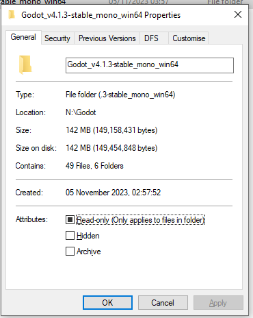

# The Basics

The first thing any good game starts with is an empty project. However, the first thing any good empty project starts with is an installation of the engine, so let's get one of those first. 
The engine can, of course, be downloaded from [the Godot website](https://godotengine.org/download/windows/).
The first thing I noticed is that the engine is only a 60MB download. Compared to [Unreal's 115GB storage requirement](https://catnessgames.com/blog/unreal-engine-5-equirements/), 
this reflects Godot's focus on being lightweight, which is exactly what I wanted for this project.

